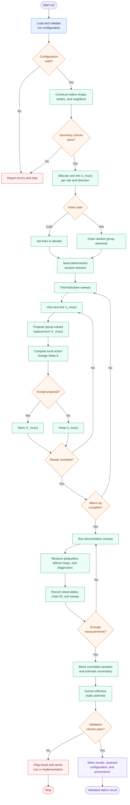
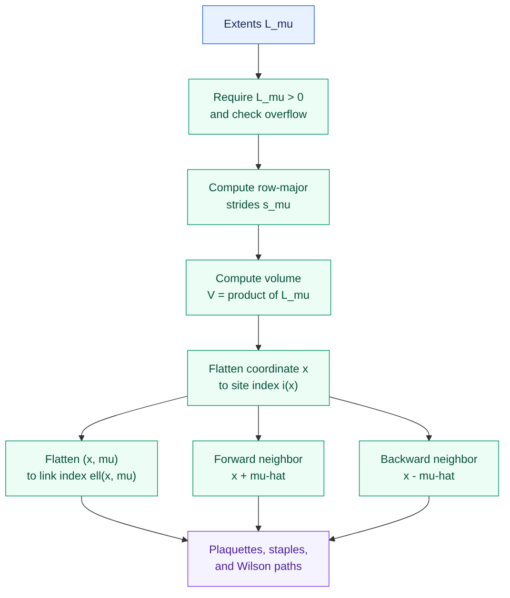
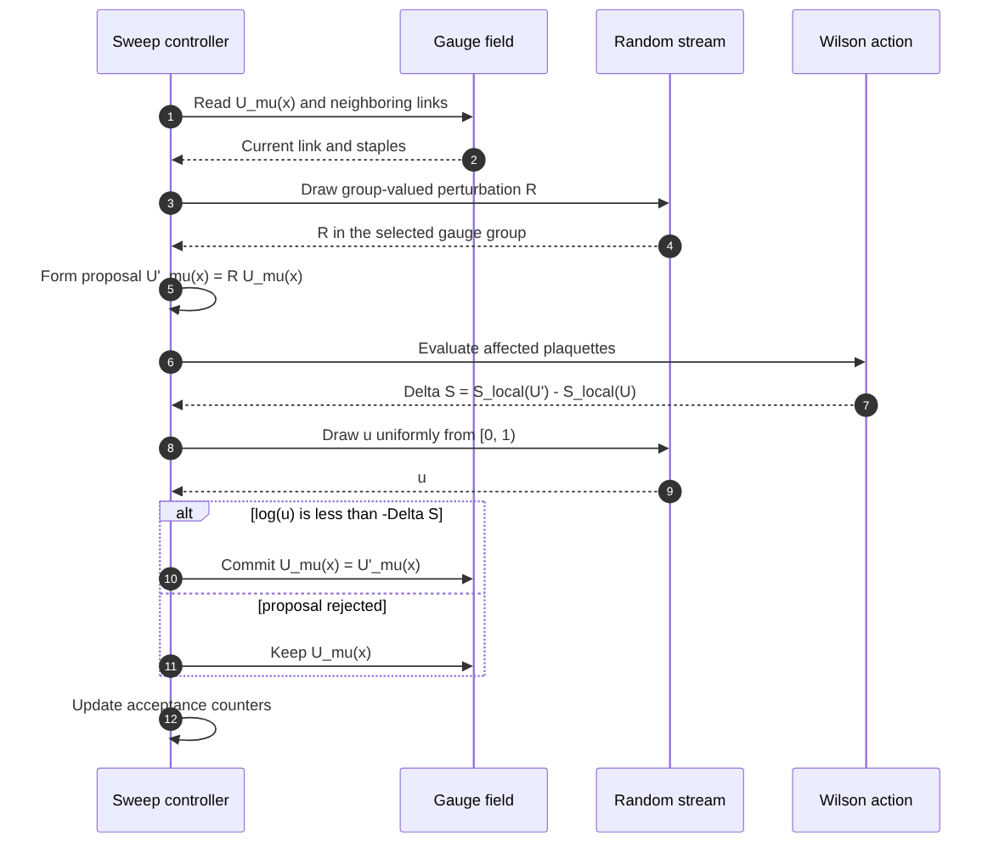
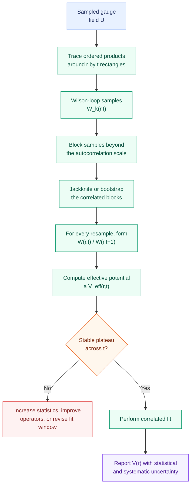
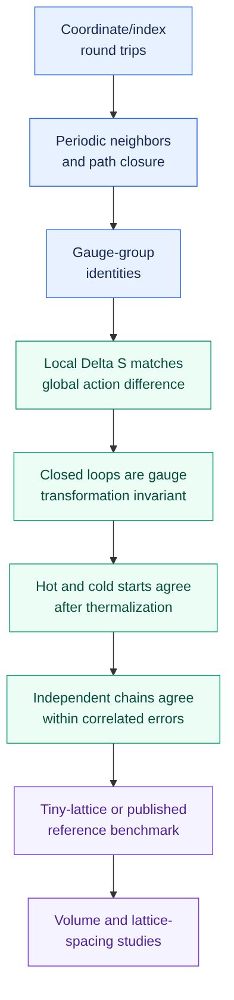

# Lattice calculation flow

This page is a visual and mathematical reference for the planned pure-gauge
lattice calculation. It follows one run from lattice construction through
Monte Carlo sampling, observable measurement, and static-potential extraction.
The full simulation pipeline is not yet implemented.

The equations below have renderer-independent text fallbacks. For the full
typeset reference—with numbered equations, a notation table, an interpretation
after every expression, and explicit step outputs—open the
[rendered PDF](equations/lattice-equations.pdf) or its
[LaTeX source](equations/lattice-equations.tex).

## End-to-end calculation



[Mermaid source](diagrams/lattice-end-to-end.mmd) ·
[SVG](diagrams/lattice-end-to-end.svg)

## Symbols used

| Symbol | Meaning |
| --- | --- |
| `D` | Number of lattice dimensions |
| `x` | Site coordinate `(x_0, ..., x_(D-1))` |
| `L_μ` | Number of sites in direction `μ` |
| `V` | Total lattice volume, measured in sites |
| `V(r)` | Static potential at source separation `r` |
| `μ, ν` | Direction indices from `0` through `D - 1` |
| `U_μ(x)` | Gauge link leaving site `x` in direction `μ` |
| `N` | Matrix size of `SU(N)`; for QCD, `N = 3` |
| `β` | Bare inverse gauge coupling in the Wilson action |
| `a` | Lattice spacing |
| `r, t` | Spatial and Euclidean-time extents of a Wilson loop |

## Step 1: construct the lattice

For a periodic D-dimensional lattice, the allowed sites are:

```text
Λ = { x = (x_0, ..., x_(D-1))  |  0 ≤ x_μ < L_μ }
```

The number of sites is the product of the extents:

```text
V = ∏_(μ=0)^(D-1) L_μ
```

For row-major storage, compute a stride for each direction and flatten the
coordinate:

```text
s_0 = 1
s_μ = ∏_(ν=0)^(μ-1) L_ν

i(x) = Σ_(μ=0)^(D-1) x_μ s_μ
```

Each site owns D outgoing links, so a site/direction pair can be flattened as:

```text
link_index(x, μ) = D i(x) + μ

0 ≤ link_index < D V
```

Periodic neighbors wrap one coordinate and leave the others unchanged:

```text
forward(x, μ)_ν =
    (x_μ + 1) mod L_μ    when ν = μ
    x_ν                  when ν ≠ μ

backward(x, μ)_ν =
    (x_μ + L_μ - 1) mod L_μ    when ν = μ
    x_ν                        when ν ≠ μ
```



[Mermaid source](diagrams/lattice-geometry.mmd) ·
[SVG](diagrams/lattice-geometry.svg)

## Step 2: initialize the gauge field

Every directed lattice link stores an element of the chosen gauge group:

```text
U_μ(x) ∈ G

G = U(1), SU(2), or SU(3)
```

A cold start sets every link to the identity matrix. A hot start draws random
valid group elements:

```text
cold start:  U_μ(x) = I
hot start:   U_μ(x) = random element of G
```

For SU(N), valid links should satisfy these numerical checks:

```text
U† U ≈ I
det(U) ≈ 1
```

## Step 3: calculate plaquettes and the gauge action

The oriented plaquette is the ordered product around one elementary square:

```text
U_(μν)(x) = U_μ(x)
             U_ν(x + μ_hat)
             U_μ†(x + ν_hat)
             U_ν†(x)
```

For a pure SU(N) theory, the Wilson gauge action is:

```text
S_W[U] = β Σ_x Σ_(μ<ν) [ 1 - ReTr(U_(μν)(x)) / N ]
```

The target expectation value of an observable O is conceptually:

```text
⟨O⟩ = [ ∫ DU O[U] exp(-S_W[U]) ] / [ ∫ DU exp(-S_W[U]) ]
```

The program does not enumerate this integral. It builds a Markov chain whose
configurations occur with probability proportional to `exp(-S_W[U])`.

## Step 4: propose one local link update

For the current link `U_μ(x)`, draw a small group-valued perturbation `R` and
form a valid proposal:

```text
U'_μ(x) = R U_μ(x)
```

Only plaquettes containing that link can change. Compute their old and proposed
contributions instead of recomputing the entire lattice action:

```text
ΔS = S_local[U'] - S_local[U]
```

For a link in D dimensions, the local contribution involves
`2(D - 1)` oriented staples. Schematically:

```text
staple_μ(x) = Σ_(ν≠μ) [ forward_staple_(μν)(x)
                       + backward_staple_(μν)(x) ]
```

The exact multiplication order must match the plaquette convention used by the
global Wilson action.

## Step 5: accept or reject the proposal

The Metropolis acceptance probability is:

```text
P_accept = min(1, exp(-ΔS))
```

Draw `u` uniformly from `[0, 1)`. The decision is:

```text
if log(u) < -ΔS:
    U_μ(x) ← U'_μ(x)     accept
else:
    U_μ(x) unchanged     reject
```

This is equivalent to testing `u < P_accept`, but avoids explicitly computing
an exponential that may underflow. Visiting every site and direction once is
one sweep.



[Mermaid source](diagrams/local-link-update.mmd) ·
[SVG](diagrams/local-link-update.svg)

## Step 6: thermalize and collect measurements

Discard warm-up sweeps, then separate saved measurements with update sweeps:

```text
repeat N_warmup times:
    perform one full sweep

repeat N_measurements times:
    repeat N_spacing times:
        perform one full sweep
    measure plaquettes and Wilson loops
```

The mean plaquette is the normalized real trace averaged over all elementary
plaquettes:

```text
P_bar = (1 / N_plaquettes)
        Σ_x Σ_(μ<ν) ReTr(U_(μν)(x)) / N

N_plaquettes = V D(D - 1) / 2
```

For a rectangular path `C_(r,t)`, the Wilson loop is:

```text
W(r,t) = (1/N) < ReTr( ∏_((x,μ) in C_(r,t)) U_μ(x) ) >
```

The product is path ordered. Traversing a link backward uses `U_μ†(x)` rather
than `U_μ(x)`.

## Step 7: extract the static potential

At sufficiently large Euclidean time, a Wilson loop is expected to behave as:

```text
W(r,t) ≈ A(r) exp(-a V(r) t)
```

Taking the ratio at neighboring time extents cancels the unknown amplitude
`A(r)`:

```text
a V_eff(r,t) = log( W(r,t) / W(r,t+1) )
```

For each separation `r`, inspect `V_eff(r,t)` as `t` increases. A stable region
is the candidate plateau:

```text
V_eff(r,t) ≈ constant in t  →  fit a V(r)
```

The ratio and plateau fit must be recomputed inside each block-jackknife or
bootstrap resample. Treating `W(r,t)` and `W(r,t+1)` as independent would lose
their covariance.



[Mermaid source](diagrams/static-potential.mmd) ·
[SVG](diagrams/static-potential.svg)

## Step 8: calculate correlation-aware uncertainty

For a measurement history `O_k`, the normalized lag autocorrelation is:

```text
ρ_O(τ) = Cov(O_k, O_(k+τ)) / Var(O_k)
```

Estimate the integrated autocorrelation time over a justified window:

```text
τ_int = 1/2 + Σ_(τ=1)^(τ_max) ρ_O(τ)
```

This reduces the effective number of independent measurements:

```text
N_eff ≈ N_measurements / (2 τ_int)
```

The approximate variance of the sample mean becomes:

```text
Var(O_bar) ≈ [2 τ_int / N_measurements] Var(O)
```

In practice, increase the block size until the estimated uncertainty is stable,
then use block jackknife or block bootstrap for ratios and fits.

## Validation ladder



[Mermaid source](diagrams/validation-ladder.mmd) ·
[SVG](diagrams/validation-ladder.svg)

These checkpoints distinguish a successfully executed calculation from a
scientifically defensible one. Failure at any stage should retain the run data
for diagnosis but mark the result as unvalidated.
